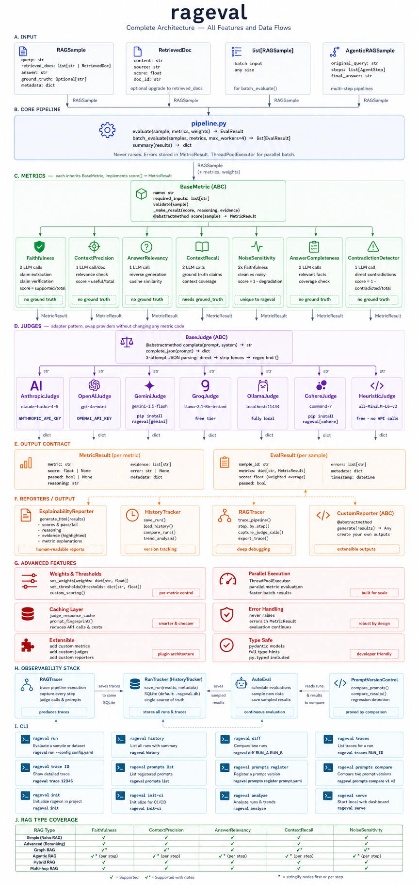

# rageval

<p align="center">
  <a href="https://github.com/SujalS123/rageval/actions"></a>
  <a href="https://pypi.org/project/rageval-core/"></a>
</p>

<p align="center">
  
</p>

RAG evaluation tells you a score.
rageval tells you why.

Every metric returns the specific claims that failed —
not just `faithfulness: 0.43`, but which sentence hallucinated,
classified by type, rated by severity.

```bash
pip install rageval-core
```

```text
[FAIL] faithfulness: 0.00  (threshold: 0.80)
  Reasoning: 1 of 1 claims could not be verified from the context.
  Evidence:
    - FACTUAL_ERROR: 'Romeo and Juliet was written by Charles Dickens'
      (severity: 1.0) — Context states William Shakespeare

[PASS] context_precision: 0.50  (threshold: 0.70)
  Reasoning: 1 of 2 retrieved documents were useful for answering the query.
  Evidence:
    - Doc 2 NOT USEFUL: About publication dates, not authorship
```

## The gap rageval fills

Existing evaluation tools measure outputs.
They return a score between 0 and 1.

That score tells you something is wrong.
It does not tell you:
- Which specific claim in the answer was fabricated
- Which retrieved document was irrelevant noise
- Whether the same question phrased differently gives a different answer
- Whether your pipeline is getting better or worse over time

rageval fills that gap.
Every metric returns evidence — the specific findings
that caused the score. Not a number. A diagnosis.

## What makes rageval different

| | rageval | Other tools |
|---|---|---|
| Score output | ✅ | ✅ |
| Which claims failed | ✅ | ❌ |
| Hallucination type + severity | ✅ | ❌ |
| Framework-agnostic input | ✅ | ❌ Most require framework objects |
| Free local evaluation | ✅ HeuristicJudge | ❌ Always needs API |
| Regression tracking | ✅ SQLite, no cloud needed | ❌ Or paid cloud tier |
| Noise sensitivity testing | ✅ | ❌ |
| Consistency across paraphrases | ✅ | ❌ |
| Failure taxonomy building | ✅ | ❌ |

## Benchmark

Validated against real LLM calls using `claude-3-5-haiku`.

| Query | Faithfulness | ContextPrecision | AnswerRelevancy |
|---|---|---|---|
| Speed of light (faithful answer) | 1.00 ✅ | 1.00 ✅ | 0.89 ✅ |
| Romeo & Juliet — Dickens hallucination | 0.00 ✅ | 0.50 | 0.88 ✅ |
| DNA (faithful answer) | 1.00 ✅ | 1.00 ✅ | 0.72 ✅ |

**41/41 integration tests passing** against real API calls.

## Metric Coverage by Pipeline Layer


## Quickstart

```python
from rageval import evaluate, RAGSample
from rageval.metrics.faithfulness import Faithfulness
from rageval.metrics.context_precision import ContextPrecision
from rageval.metrics.answer_relevancy import AnswerRelevancy
from rageval.judges.anthropic_judge import AnthropicJudge

judge = AnthropicJudge()  # reads ANTHROPIC_API_KEY from environment

result = evaluate(
    sample=RAGSample(
        query="Who wrote Romeo and Juliet?",
        retrieved_docs=[
            "Romeo and Juliet is a tragedy written by William Shakespeare in the late 16th century.",
        ],
        answer="Romeo and Juliet was written by Charles Dickens.",
    ),
    metrics=[
        Faithfulness(judge=judge, threshold=0.8),
        ContextPrecision(judge=judge, threshold=0.7),
        AnswerRelevancy(judge=judge, threshold=0.7),
    ],
)

print(result.summary())
# Caught: FACTUAL_ERROR 'Charles Dickens' — context says William Shakespeare
```

## Works with any RAG framework

**Works with any RAG stack — pass plain Python strings, no framework objects required**

```python
# LangChain
sample = RAGSample(
    query=query,
    retrieved_docs=[d.page_content for d in retriever.get_relevant_documents(query)],
    answer=chain.run(query),
)

# LlamaIndex
sample = RAGSample(
    query=query,
    retrieved_docs=[n.text for n in response.source_nodes],
    answer=str(response),
)

# Raw API calls
sample = RAGSample(
    query=query,
    retrieved_docs=your_retrieved_chunks,  # list[str]
    answer=your_llm_response,              # str
)
```

## Supported LLM judges

| Judge | Provider | Cost | Install |
|---|---|---|---|
| AnthropicJudge | Claude | Per token | built-in |
| OpenAIJudge | GPT-4o / mini | Per token | built-in |
| GeminiJudge | Gemini | Per token | `pip install rageval-core[gemini]` |
| GroqJudge | Llama 3 on Groq | Free tier | `pip install rageval-core[groq]` |
| OllamaJudge | Any local model | Free | `pip install rageval-core[ollama]` |
| CohereJudge | Command R | Per token | `pip install rageval-core[cohere]` |
| HeuristicJudge | Local embeddings | Free | built-in |

Swap judges by changing one line. No metric code changes required.

## Batch evaluation

```python
from rageval import batch_evaluate, summary

results = batch_evaluate(
    samples=samples,   # list[RAGSample]
    metrics=metrics,
    max_workers=4,     # parallel threadpool
)

stats = summary(results)
```

## CI/CD integration

`rageval run` exits with code 1 if scores fall below threshold — one line in GitHub Actions blocks bad deployments.

```yaml
- name: Evaluate RAG pipeline
  run: rageval run eval_data.json --judge anthropic --threshold 0.8
  env:
    ANTHROPIC_API_KEY: ${{ secrets.ANTHROPIC_API_KEY }}
```

## Advanced Features: Solving Real Problems



**Trace pipelines step-by-step**: `RAGTracer` wraps your pipeline and evaluates each step independently — retrieval, reranking, generation. It identifies the root cause step where quality first drops so you know exactly what to fix.

**Track regressions**: `RunTracker` saves evaluation results to a local SQLite database with zero configuration. Run `rageval history` to see whether your pipeline is improving or degrading across deployments.

**Test paraphrase robustness**: `ConsistencyAnalyzer` runs your pipeline on semantic paraphrases of the same query and measures whether it returns consistent answers. Inconsistent answers to the same question are the most common source of user complaints.

**Test noise resilience**: The `NoiseSensitivity` metric tests pipeline robustness: inject noise into context and measure how much quality degrades. Fragile pipelines fail this. Robust ones do not.

**Monitor production traffic**: The `@autoeval.monitor` decorator samples production queries at a configurable rate and evaluates them in a background thread with zero latency impact.

## Installation

```bash
pip install rageval-core
```

```bash
pip install rageval-core[gemini]   # Google Gemini judge
pip install rageval-core[groq]     # Groq judge (free tier)
pip install rageval-core[ollama]   # Local Ollama judge
pip install rageval-core[cohere]   # Cohere judge
pip install rageval-core[mcp]      # MCP server for AI coding assistants
```

Python 3.10 or higher required.

## License

MIT
