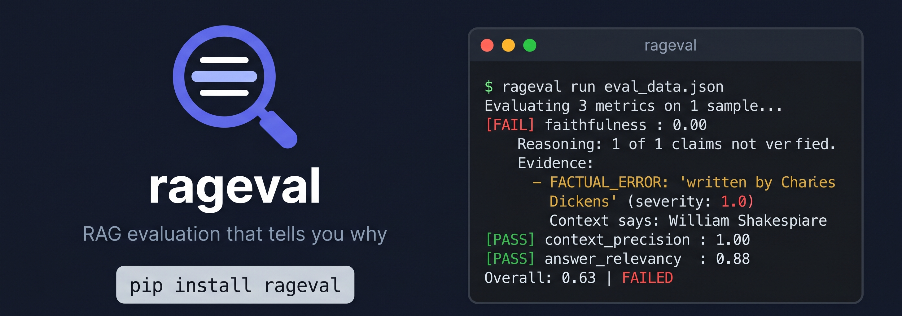
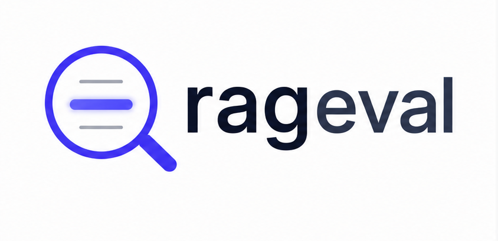
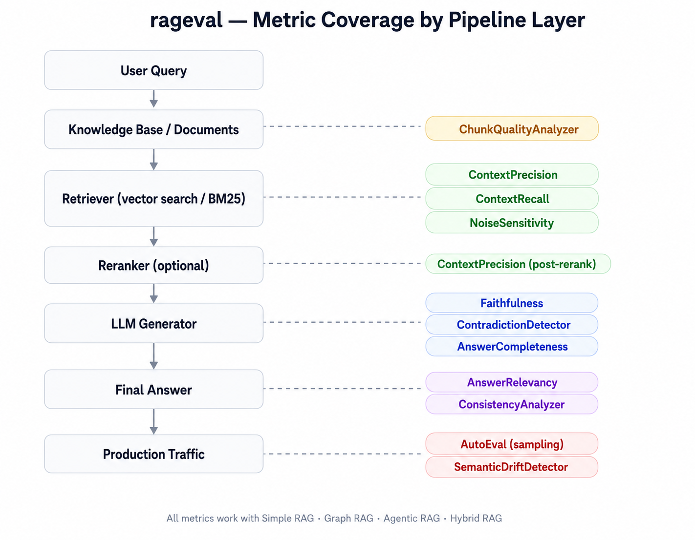

# rageval


<p align="center">
  
</p>

<p align="center">
  
</p>

Every RAG evaluation tool tells you faithfulness is 0.43. None of them tell you which sentence hallucinated, which document was noise, or what to fix. rageval does.
```bash
pip install rageval
```

## The problem

A developer deployed a RAG chatbot. Users complained it was making things up. They ran an evaluation tool. Got a number. The number told them something was wrong. It did not tell them what was wrong or how to fix it. They spent two weeks reading outputs manually to find failures that a better tool would have surfaced in seconds.

The actually useful information is not the score. It is the evidence. Which specific claim in the answer is fabricated. Which retrieved document was irrelevant noise. Which sentence contradicted the context. Without that information a developer is guessing at whether to fix the retriever, the prompt, the chunking strategy, or the model.

## What rageval returns



```
[FAIL] faithfulness: 0.00  (threshold: 0.80)
  Reasoning: 1 of 1 claims could not be verified from the context.
  Evidence:
    - FACTUAL_ERROR: 'Romeo and Juliet was written by Charles Dickens'
      (severity: 1.0) — Context states William Shakespeare

[PASS] context_precision: 0.50  (threshold: 0.70)
  Reasoning: 1 of 2 retrieved documents were useful for answering the query.
  Evidence:
    - Doc 2 NOT USEFUL: About publication dates, not authorship

[PASS] answer_relevancy: 0.88  (threshold: 0.70)
  Reasoning: Average cosine similarity between original query and
  3 reverse-generated questions: 0.88
```

Not a number. A diagnosis.

## Quickstart

```bash
pip install rageval
```

```python
from rageval import evaluate, RAGSample
from rageval.metrics.faithfulness import Faithfulness
from rageval.metrics.context_precision import ContextPrecision
from rageval.metrics.answer_relevancy import AnswerRelevancy
from rageval.judges.anthropic_judge import AnthropicJudge

judge = AnthropicJudge()  # reads ANTHROPIC_API_KEY from environment
# or: from rageval.judges.openai_judge import OpenAIJudge; judge = OpenAIJudge()

result = evaluate(
    sample=RAGSample(
        query="Who wrote Romeo and Juliet?",
        retrieved_docs=[
            "Romeo and Juliet is a tragedy written by William Shakespeare "
            "in the late 16th century.",
        ],
        answer="Romeo and Juliet was written by Charles Dickens.",
    ),
    metrics=[
        Faithfulness(judge=judge, threshold=0.8),
        ContextPrecision(judge=judge, threshold=0.7),
        AnswerRelevancy(judge=judge, threshold=0.7),
    ],
)

print(result.summary())
# Caught: FACTUAL_ERROR 'Charles Dickens' — context says William Shakespeare
```

## Works with any RAG framework

```python
# LangChain
docs = retriever.get_relevant_documents(query)
sample = RAGSample(
    query=query,
    retrieved_docs=[d.page_content for d in docs],
    answer=chain.run(query),
)
```

```python
# LlamaIndex
response = query_engine.query(query)
sample = RAGSample(
    query=query,
    retrieved_docs=[n.text for n in response.source_nodes],
    answer=str(response),
)
```

```python
# Raw OpenAI — or any other setup
sample = RAGSample(
    query=query,
    retrieved_docs=your_retrieved_chunks,  # list[str]
    answer=your_llm_response,              # str
)
```

No framework objects. No adapters. Just strings.

## Metrics

| Metric | Measures | Needs ground truth | What low score means |
|---|---|---|---|
| Faithfulness | Does the answer make claims supported by context? | No | LLM is hallucinating |
| ContextPrecision | What fraction of retrieved docs were useful? | No | Retriever is returning noise |
| AnswerRelevancy | Does the answer address the original question? | No | Answer drifted off topic |
| ContextRecall | Did retrieval find all needed information? | Yes | Retriever is missing documents |
| NoiseSensitivity | Does pipeline degrade when noise is injected? | No | Pipeline is fragile |
| AnswerCompleteness | Does answer cover all available relevant facts? | No | Answer is incomplete |
| ContradictionDetector | Does answer contradict the context? | No | Answer reverses context facts |

## Benchmark

Validated against real LLM calls using claude-haiku-4-5.

| Query | Faithfulness | ContextPrecision | AnswerRelevancy |
|---|---|---|---|
| Speed of light (faithful answer) | 1.00 ✅ | 1.00 ✅ | 0.89 ✅ |
| Romeo & Juliet — Dickens hallucination | 0.00 ✅ | 0.50 | 0.88 ✅ |
| DNA (faithful answer) | 1.00 ✅ | 1.00 ✅ | 0.72 ✅ |

41/41 integration tests passing against real API calls.

## Supported LLM judges

| Judge | Provider | Cost | Install |
|---|---|---|---|
| AnthropicJudge | Claude | Per token | built-in |
| OpenAIJudge | GPT-4o / GPT-4o-mini | Per token | built-in |
| GeminiJudge | Gemini | Per token | pip install rageval[gemini] |
| GroqJudge | Llama 3 on Groq | Free tier | pip install rageval[groq] |
| OllamaJudge | Any local model | Free | pip install rageval[ollama] |
| CohereJudge | Command R | Per token | pip install rageval[cohere] |
| HeuristicJudge | Local embeddings | Free | built-in |

Swap judges by changing one line. No metric code changes required.

## Batch evaluation

```python
from rageval import batch_evaluate, summary

results = batch_evaluate(
    samples=samples,   # list[RAGSample]
    metrics=metrics,
    max_workers=4,     # parallel — stays under rate limits
)

stats = summary(results)
# {
#   "total_samples": 100,
#   "overall_pass_rate": 0.84,
#   "per_metric": {
#     "faithfulness": {"avg_score": 0.87, "pass_rate": 0.91},
#     "context_precision": {"avg_score": 0.79, "pass_rate": 0.83},
#   }
# }
```

## CI/CD integration

rageval run exits with code 1 if scores fall below threshold — one line in GitHub Actions gates your RAG deployments on eval quality.

```yaml
- name: Evaluate RAG pipeline
  run: rageval run eval_data.json --judge anthropic --threshold 0.8
  env:
    ANTHROPIC_API_KEY: ${{ secrets.ANTHROPIC_API_KEY }}
```

```json
[
  {
    "query": "What is Python?",
    "retrieved_docs": ["Python is a high-level programming language..."],
    "answer": "Python is a programming language created by Guido van Rossum."
  }
]
```

## Why not RAGAS or DeepEval

| Feature | rageval | RAGAS | DeepEval |
|---|---|---|---|
| Framework-agnostic input | ✅ | ❌ Requires LangChain types | ⚠️ Partial |
| Evidence per score (which claims failed) | ✅ | ❌ Float only | ❌ Float only |
| Hallucination type classification | ✅ | ❌ | ❌ |
| Works with Ollama / local models | ✅ | ❌ | ⚠️ Partial |
| CI/CD exit codes built-in | ✅ | ❌ | ⚠️ Partial |
| Noise sensitivity metric | ✅ | ❌ | ❌ |
| Step-level pipeline tracing | ✅ | ❌ | ❌ |
| Regression tracking built-in | ✅ | ❌ | ❌ |
| Zero required infrastructure | ✅ | ✅ | ✅ |

## Advanced features


RAGTracer wraps your pipeline and evaluates each step independently — retrieval, reranking, generation. It identifies the root cause step where quality first drops so you know exactly what to fix.

RunTracker saves evaluation results to a local SQLite database with zero configuration. Run rageval history to see whether your pipeline is improving or degrading across deployments.

ConsistencyAnalyzer runs your pipeline on semantic paraphrases of the same query and measures whether it returns consistent answers. Inconsistent answers to the same question are the most common source of user complaints.

The @autoeval.monitor decorator samples production queries at a configurable rate and evaluates them in a background thread with zero latency impact. It fires an alert function when rolling scores drop below threshold.

## Installation

```bash
pip install rageval
```

```bash
pip install rageval[gemini]   # Google Gemini judge
pip install rageval[groq]     # Groq judge (free tier)
pip install rageval[ollama]   # Local Ollama judge
pip install rageval[cohere]   # Cohere judge
pip install rageval[mcp]      # MCP server for AI coding assistants
```

Python 3.10 or higher required.

## License

MIT
